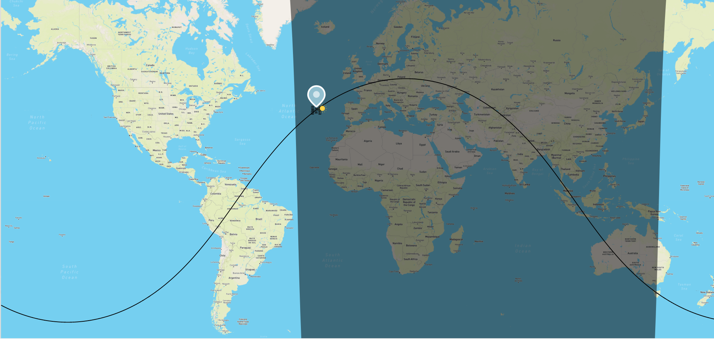

# Project description

This webapp has a backend in the form of a FastAPI app. 

This backend exposes two entry points : `/iss/position` and `/iss/illumination` to retrieve the status of the ISS and the last time windows when it was exposed to the sun.
The frontend is a ReactJS webapp showing a map of Earth (made with Pigeon Map with Mapbox provider). The map shows the ISS position and hovering the ISS icon with the mouse reveals the last time windows the ISS was exposed to the sun. The TLE (Two Line Elements) of the ISS is fetched hourly in order to draw its ground track.



The frontend is a ReactJS webapp showing a map of earth (made with Pigeon Map with Mapbox provider). The map shows the 
ISS position and hovering the ISS icon with the mouse reveals a popup showing
the last time windows when the ISS was exposed to the sun.

Note : the frontend uses css because of the simplicity of the GUI (no button and very little text), the use of 
frameworks like Tailwind CSS seemed overkill.

# How to run webapp
## Run with docker

With docker running, open a terminal at the root of the project and run :

```console
docker-compose up
```
## Run without docker

### Run the backend
`cd` to `\back` then:
```console
pip install -r requirements.txt
uvicorn api.main:app --reload
```
### Run the frontend
`cd` to `\front` then: 
```console
npm install
npm start
```
# How to run unit tests

Using a bash command line :
`cd` to `\back` then:
```console
chmod +x run_tests.sh
./run_tests.sh
```

